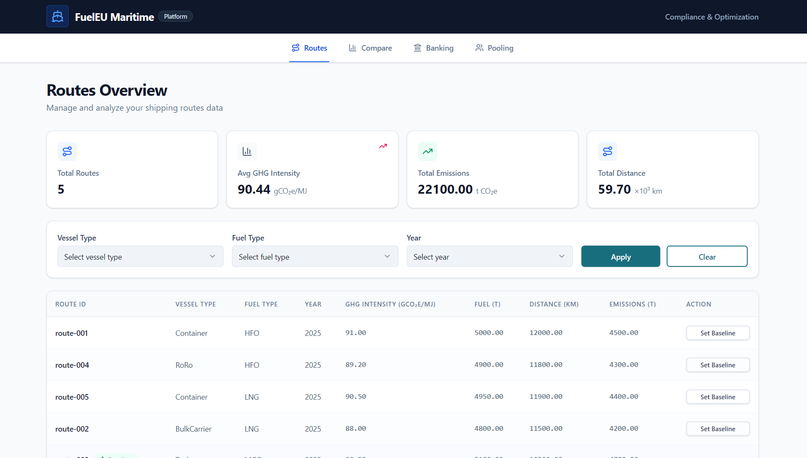
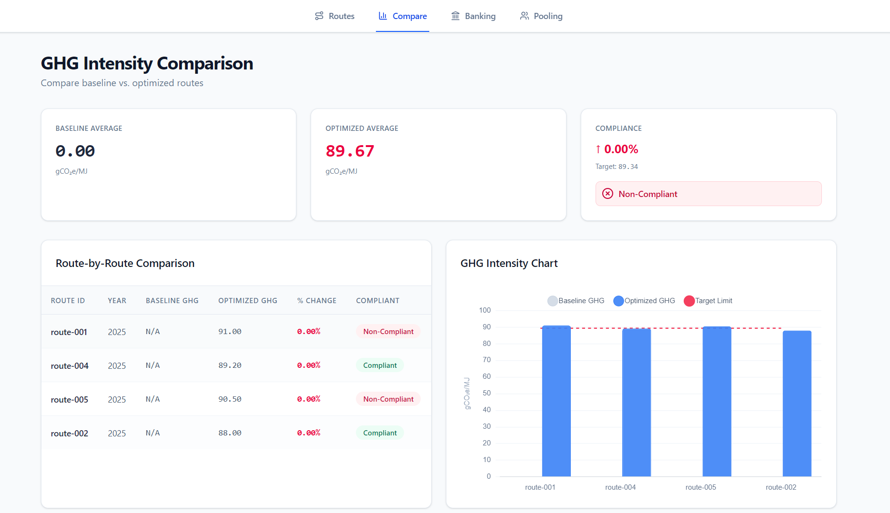
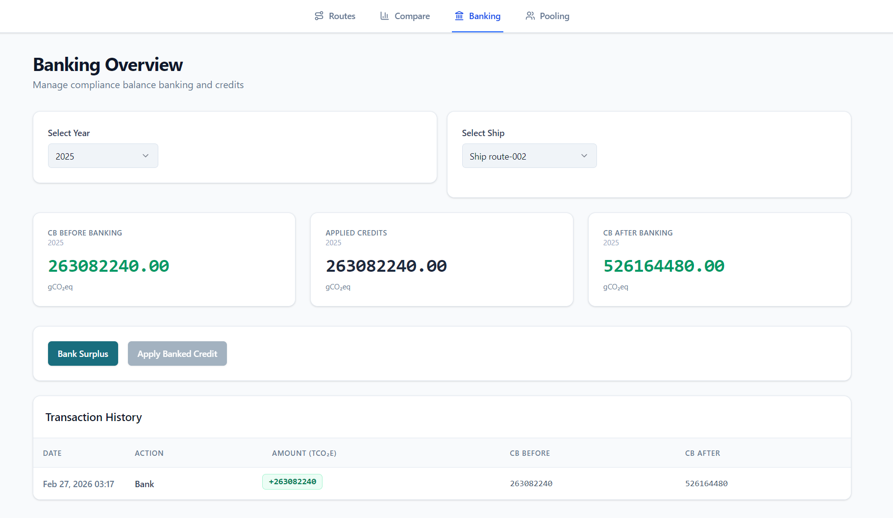
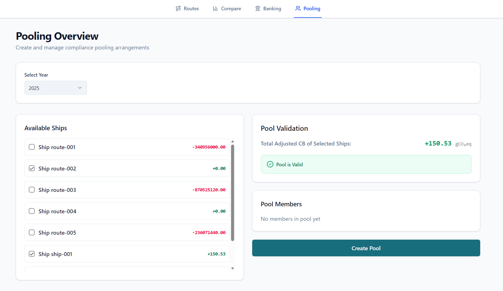

# FuelEU Maritime Compliance Platform

[](./ARCHITECTURE.md)
[](https://fuel-eu-maritime-henna.vercel.app/)
[](https://github.com/sunilbishnoi1/FuelEU-Maritime)
[](https://github.com/sunilbishnoi1/FuelEU-Maritime)



## 🎯 Overview

FuelEU Maritime Compliance Platform is an enterprise solution designed to help shipping companies navigate the complex regulatory landscape of **FuelEU Maritime** (Regulation (EU) 2023/1805). It provides automated monitoring and optimization tools for:

- **GHG Intensity Tracking**: Real-time calculation and monitoring of fleet GHG intensity (gCO₂e/MJ).
- **Compliance Mechanisms**: Full implementation of **Banking** (Article 20) for surplus management and **Pooling** (Article 21) for collaborative compliance sharing.
- **Optimization**: Comparative performance analysis against regulatory baselines to identify optimization opportunities.

---

## �️ Architecture Summary (Hexagonal Structure)

The platform is engineered using **Hexagonal Architecture (Ports & Adapters)** on both the backend and frontend. This design pattern ensures that the core domain logic (compliance calculations, regulatory rules) remains isolated from technical details like databases, UI frameworks, or third-party APIs.

- **Core Layer**: Contains pure, framework-free domain logic and application use cases.
- **Ports**: Defines the interfaces for inbound (UI, API) and outbound (PostgreSQL, External Services) communication.
- **Adapters**: Implements the details (Express.js, React/Vite, PostgreSQL) without bleeding infrastructure logic into the business rules.

---

## 🚀 Setup & Run Instructions

This repository uses a workspace-style structure with a root `package.json` to manage both services concurrently.

### Quick Start

```bash
# 1. Install all dependencies for both frontend and backend
npm run install:all

# 2. Start both services simultaneously
npm run dev
```

### Prerequisites
- **Node.js**: v18+
- **npm** or **Yarn**
- **PostgreSQL**: Optional (Automated fallback to mocks if not provided)


---

## ✅ How to Execute Tests

Reliability is a core pillar of the platform, ensured by comprehensive test suites.

- **Backend Tests**: Focus on domain logic (Jest) and API integration.
  ```bash
  cd backend && npm test
  ```
- **Frontend Tests**: Application use-case testing decoupled from UI (Vitest).
  ```bash
  cd frontend && npm test
  ```

---

## 📸 Screenshots & Sample Samples

### 1. Routes Management

*Central dashboard for tracking fleet-wide GHG intensity and route performance.*

### 2. Comparative Analysis

*Detailed vessel comparisons against baseline regulatory targets.*

### 3. Banking (Article 20)

*Management of compliance surplus credits across years.*

### 4. Pooling (Article 21)

*Collaborative compliance sharing between vessels with regulatory validation.*

### Sample API Response (Routes)
```json
[
  {
    "id": "123bbffb-f6d1-4468-adbd-f924dbe14556",
    "routeId": "route-004",
    "year": 2025,
    "ghgIntensity": 92.0,
    "vesselType": "RoRO",
    "fuelType": "HFO",
    "totalEmissions": 4300
  }
]
```

---

## 📚 Further Documentation

- [ARCHITECTURE.md](./ARCHITECTURE.md): In-depth breakdown of the Hexagonal design.
- [REFLECTION.md](./REFLECTION.md): Development process and AI orchestration insights.
- [AGENT_WORKFLOW.md](./AGENT_WORKFLOW.md): Detailed logs of the agent's iterative progress.

---

### License
This project is licensed under the MIT License.
